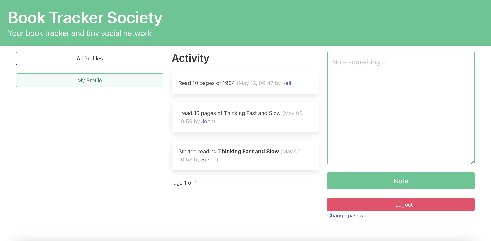
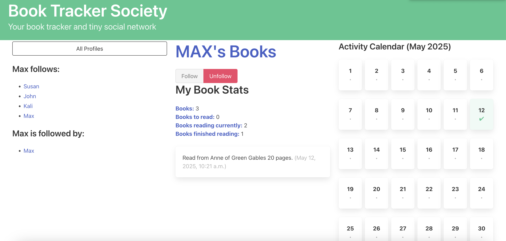
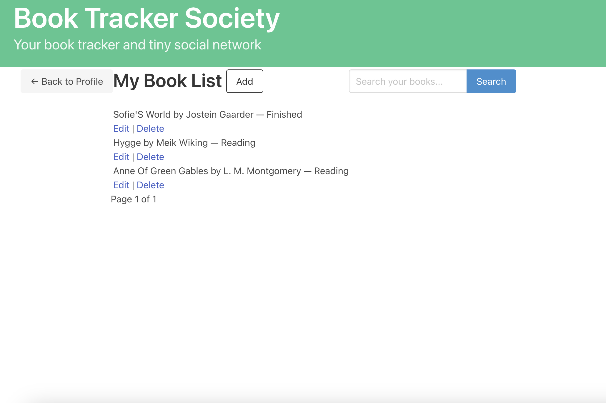

# 📚 Django Book Tracker Society

A full-stack Django web application for tracking reading progress, sharing book notes, and connecting with fellow readers.

## 🚀 Features

- 📖 **Personal Library**: Add books to your profile and track reading status (To Read, Reading, Finished).
- 📝 **Notes System**: Add personal notes about books; view notes shared by people you follow.
- 🔁 **Activity Feed**: See updates when followed users start, finish, or add books.
- 👥 **Profiles & Following**: Create your profile and follow others to build a reading community.
- 🔍 **Search Functionality**: Search books in your library by title or author.
- 📊 **Progress Tracker** *(Coming Soon)*: Track your progress (pages read) and visualize completion percentage.
- 🧩 **Authentication**: Sign up, log in/out, and change password securely.
- 🎨 **Responsive UI**: Built with Bulma CSS framework for clean and responsive design.

## 📷 Screenshots

### Dashboard & Activity View


### Profile view


### Booklist view


## 🛠 Tech Stack

- **Backend**: Python, Django
- **Frontend**: HTML, Django templates, Bulma CSS
- **Database**: SQLite (development), PostgreSQL-ready
- **Other**: WTForms, Django Messages Framework


## ✅ Setup Instructions

1. **Clone the Repository**
   ```bash
   git clone https://github.com/yourusername/book-tracker-society.git
   cd book-tracker-society
     ```
1. **Clone the Repository**
   ```bash
   git clone https://github.com/yourusername/book-tracker-society.git
   cd book-tracker-society
     ```
2. **Create Virtual Environment & Install Dependencies**
   ```bash
   python -m venv env
   source env/bin/activate
   pip install -r requirements.txt
   ```
3. **Run Migrations**
   ```bash
   python manage.py migrate
   ```
   
4. **Create a Superuser (optional)**
   ```bash
   python manage.py createsuperuser
   ```
5. **Run the Server**
   ```bash
   python manage.py runserver
   ```
6. **Visit http://127.0.0.1:8000/ to explore the app.**
   
## 📈 Future Enhancements
- 📊 **Reading Progress Tracker:** Let users log pages read and show percent complete.

- 🧠 **Smart Note Parsing:** Auto-detect page numbers or keywords in user notes using AI/NLP.

- 💬 **Comments & Discussions:** Let users comment on each other's notes.

- 🖼 **Book Cover Integration:** Fetch book data and cover images from an external API (e.g., Google Books).

## 📄 License
MIT License.

